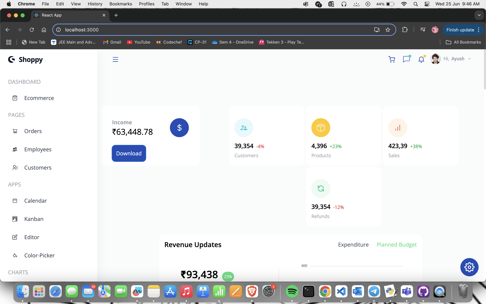
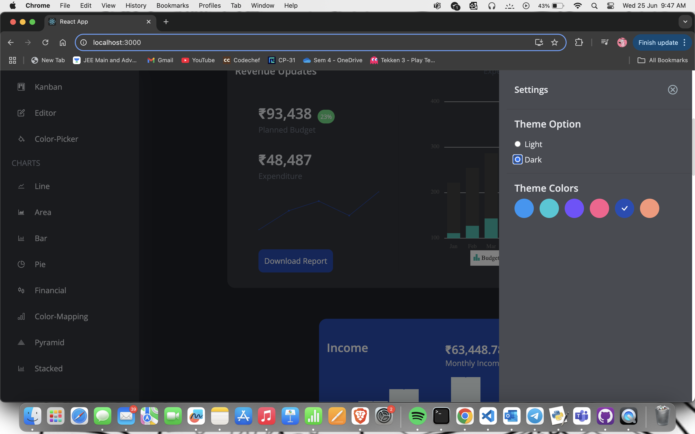
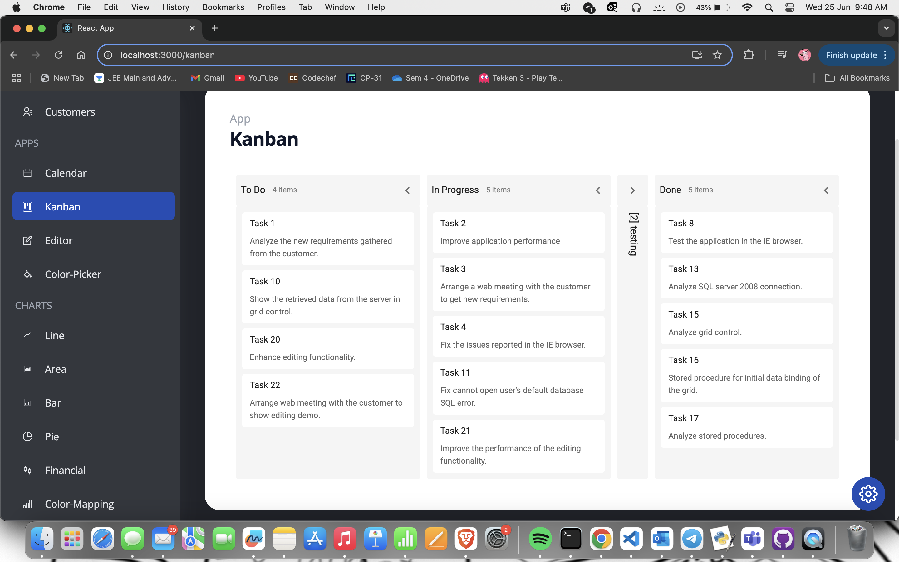
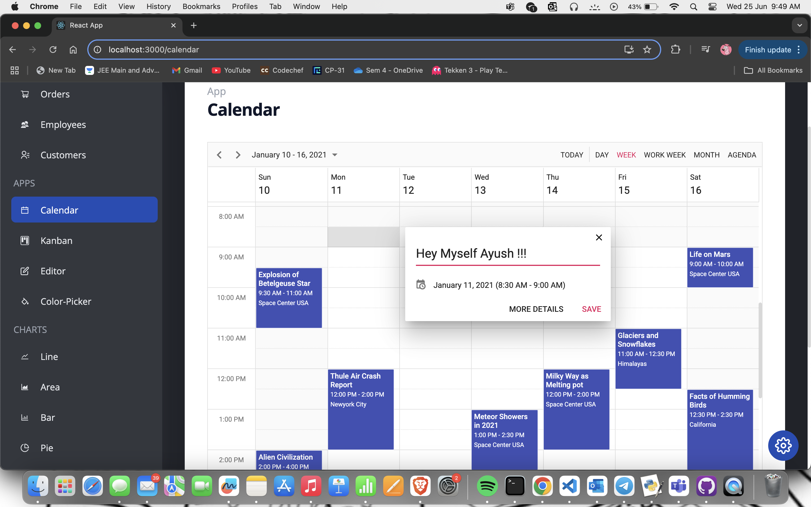

# 📊 React Admin Dashboard

A responsive and modern Admin Dashboard built with **React.js**, **Tailwind CSS**, and **Syncfusion UI components**. Designed with utilities like charts, Kanban board, calendar, theming, and more.

---

### 🛠️ Tech Stack

- **Frontend:** React.js  
- **Styling:** Tailwind CSS  
- **UI Components:** Syncfusion  
- **Languages:** HTML, JavaScript  

---

### 📁 Features Included

- 👥 Customer & Employee Listings  
- 📆 Calendar Integration  
- 🗂️ Drag-and-Drop Kanban Board  
- 📈 Dynamic Charts (Line, Area, Pie, etc.)  
- 🌗 Light/Dark Mode with Theme Customization  
- 🧩 Color Picker, Rich Text Editor, and More  
- 📱 Fully Responsive Layout  

---

### 📸 Screenshots

#### 🏠 Dashboard View  

#### 🌙 Theme Settings / Dark Mode  

#### 📋 Kanban Board  

#### 🗓️ Calendar View  

